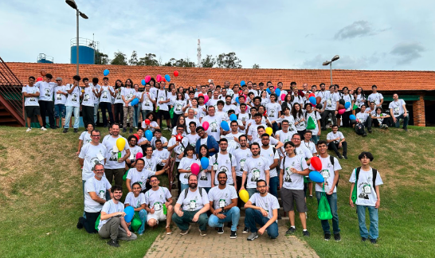

  

  
  
  
  

# InterIF - Maratona de Programação do IFSP

Bem-vindo ao repositório da **Maratona de Programação do IFSP**, também conhecida como **InterIF**!  
Aqui você encontrará provas e resoluções comentadas das edições anteriores da maratona, com foco em ajudar estudantes a praticarem e se prepararem para a competição.  
O conteúdo está sendo adicionado gradualmente — fique à vontade para contribuir!

## Estrutura do Repositório

As provas e resoluções estão organizadas por ano, de **2023 a 2018**, nos diretórios abaixo:

- [`/provas/2023`](./provas/2023)
- [`/provas/2022`](./provas/2022)
- [`/provas/2021`](./provas/2021)
- [`/provas/2020`](./provas/2020)
- [`/provas/2019`](./provas/2019)
- [`/provas/2018`](./provas/2018)

Cada pasta contém os enunciados das questões e, quando disponíveis, soluções comentadas com código e explicações.

## Sobre a InterIF

A **InterIF** é uma competição anual de programação organizada pelo Instituto Federal de São Paulo (IFSP), voltada aos estudantes regularmente matriculados nos cursos do instituto.  
Em 2025, o evento chega à sua **8ª edição**, e conta com apoio institucional da Reitoria do IFSP.

Durante a maratona, equipes compostas por três estudantes compartilham um único computador e tentam resolver o maior número possível de problemas no menor tempo.  
São avaliadas habilidades como lógica, algoritmos e programação.

A competição é dividida em duas etapas:

- **Etapa local (em cada campus):** 28 de junho de 2025, às 8h
- **Etapa final (em São Carlos):** 03 e 04 de outubro de 2025

## Links Úteis

- [Formulário de inscrição](https://forms.gle/DZXiMzVAYTPdian2A) (_até o dia 30 de maio de 2025_)
- [Edital de inscrição (PDF)](https://drive.google.com/file/d/1sYCNuBOG5vYjvzXBxJk2E24joy2g5UvX/view?usp=sharing)
- [Regulamento 2025 (PDF)](https://drive.google.com/file/d/1XqRHgWWSJDoa99_ojDFl3Dri8xIYmnCZ/view?usp=sharing)
- [Critérios de Classificação InterIF 2025 (PDF)](https://drive.google.com/file/d/1u1YiNr7PmwzxbHBR4CYooDFuawcBeYXb/view?usp=sharing)

## Mais informações

Confira o site oficial da competição:

- [https://ifsp.edu.br/interif](https://ifsp.edu.br/interif)

## Contribuições

Se você quiser contribuir com soluções, correções ou melhorias, basta enviar um **pull request** com a sua proposta. Siga o padrão de organização do repositório e, se possível, inclua comentários ou explicações junto ao código para ajudar outros estudantes a entenderem a lógica.

  

  <i>Segunda fase do InterIF 2024</i>

